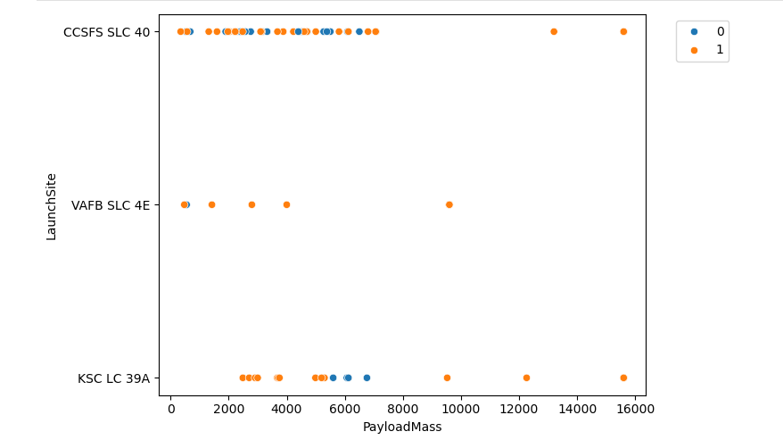
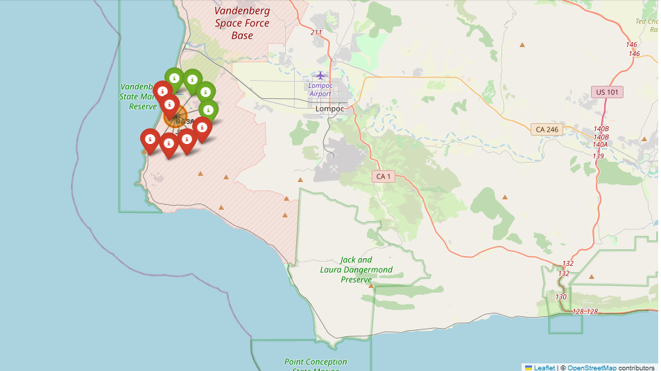
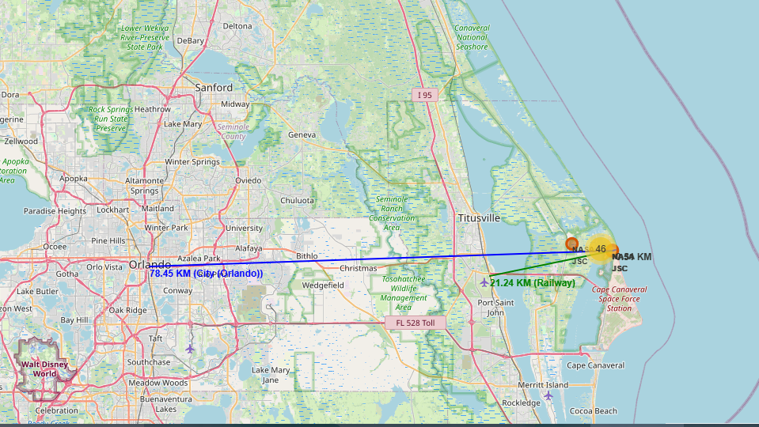
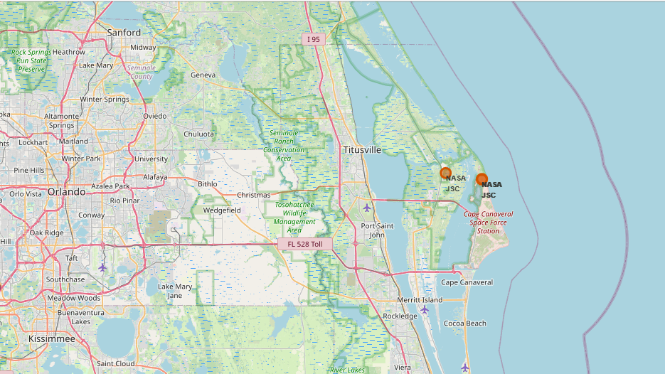
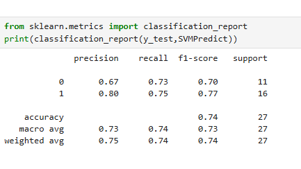
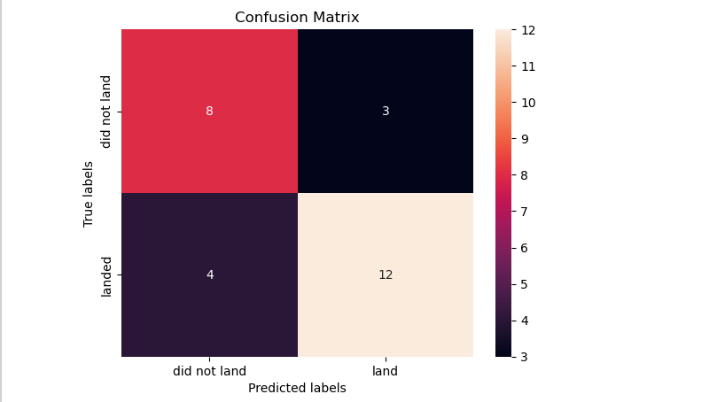

---

#  SpaceX Falcon 9 Landing Success Prediction

---

##  Project Overview
This project is an end-to-end data science capstone that analyzes historical SpaceX Falcon 9 launch data and builds machine learning models to predict the success of first-stage landings.

---

##  Objectives
- Collect launch data using the SpaceX REST API  
- Perform data wrangling and feature engineering  
- Conduct exploratory data analysis using SQL and visualization  
- Analyze launch site locations using geospatial techniques  
- Build and evaluate machine learning models for landing success prediction  

---

## Exploratory Data Analysis (EDA)

### Flight Number vs Launch Site

*Insight:* CCAFS SLC 40 shows a higher concentration of successful launches in later flight numbers, suggesting operational maturity and frequent reuse at this site.

### Flight Number vs Orbit Type

*Insight:* Missions to LEO and ISS exhibit higher success rates compared to more complex orbits, indicating that orbit complexity plays a role in landing success.

### Launch Success Trend Over Time

*Insight:* Later flight numbers show higher success rates, indicating learning effects over time as SpaceX refined reusability and landing techniques.

### Payload Mass vs Launch Site

*Insight:* Higher payload masses are predominantly launched from CCAFS SLC 40, where successful landings are still achieved, demonstrating SpaceX’s growing capability to recover boosters under heavier loads.

---
## Why SQL Was Used Separately

SQL-based exploratory analysis is intentionally isolated in  
`03_sql_exploratory_data_analysis.ipynb` to demonstrate proficiency in relational querying, aggregation, and analytical reasoning directly at the database level.

While Pandas is used in other notebooks for in-memory transformations, visualization, and machine learning workflows, SQL is leveraged here to showcase the ability to:
- Perform exploratory analysis using production-style querying
- Apply filtering, grouping, and aggregation at scale
- Translate business questions into structured queries

This separation reflects real-world data workflows, where exploratory insights are often derived directly from databases before downstream processing and modeling.

---

## Geospatial Analysis

### Launch Outcome Distribution

*Insight:* Successful and failed launches are geographically clustered around launch sites, with a higher density of successes in recent missions.

### Spatial Clustering of Launch Outcomes

*Insight:* Launch outcomes form visible clusters near the launch site, indicating consistent recovery zones and controlled descent trajectories.

### Distance to Nearest Infrastructure

*Insight:* Launch sites are strategically located at safe distances from cities, railways, and highways, minimizing risk while maintaining logistical accessibility.

### Cape Canaveral Launch Site Map

*Insight:* Cape Canaveral’s proximity to coastline and infrastructure supports efficient launch operations and controlled booster recovery in nearby landing zones.

### Vandenberg Launch Site Map

*Insight:* Vandenberg’s coastal location enables polar orbit missions while ensuring safe downrange recovery paths over the ocean.

---

## Repository Structure

- `01_data_collection_api.ipynb` – Data collection using SpaceX REST API
- `02_data_wrangling_feature_engineering.ipynb` – Data cleaning and feature engineering
- `03_sql_exploratory_data_analysis.ipynb` – SQL-based exploratory analysis
- `04_exploratory_data_analysis_visualization.ipynb` – Visual EDA
- `05_spacex_launch_site_geospatial_analysis.ipynb` – Geospatial analysis using Folium
- `06_spacex_launch_success_prediction.ipynb` – Machine learning modeling and evaluation
- `images/` – Visualization images used in README

---

##  Datasets
- `Spacex.csv` – Raw SpaceX launch data  
- `data_falcon91` – Intermediate processed dataset  
- `updated_data_falcon92` – Final cleaned dataset used for modeling  
- `spacex_launch_geo.csv` – Geospatial launch site information  
- `Data_to_be_fed.csv` – Model-ready feature dataset  
- `my_data1.db` – SQLite database used for SQL-based analysis  

---

##  Technologies Used
- Python  
- Pandas, NumPy  
- Matplotlib, Seaborn  
- Folium  
- SQL (SQLite)  
- Scikit-learn  

---

##  Machine Learning Models
- Logistic Regression  
- Support Vector Machine (SVM)  
- Decision Tree Classifier  

---

## Machine Learning Results

Multiple classification models were trained and evaluated to predict Falcon 9 first-stage landing success:

- Logistic Regression  
- Support Vector Machine (SVM)  
- Decision Tree  
- K-Nearest Neighbors (KNN)  

Among these, the **Support Vector Machine (SVM)** model achieved the **highest performance**, demonstrating superior accuracy and generalization on unseen data.

This result indicates that SVM effectively captures the non-linear relationships between launch parameters and landing outcomes, making it the most reliable model for this prediction task.

---

### Model Performance Summary

Although multiple models achieved similar accuracy (~74%), accuracy alone was found to be misleading due to class imbalance in the dataset.

Among all evaluated classifiers, the Support Vector Machine (SVM) demonstrated the most balanced performance, achieving recall values of **75% for successful landings** and **73% for failed landings**. This indicates minimal class bias and stronger generalization compared to other models, which tended to favor the majority class.
This evaluation emphasizes model reliability over raw accuracy, prioritizing consistent performance across both outcome classes.

---

### SVM Classification Report

### SVM Confusion Matrix

---

##  Key Insights
- Launch site location significantly affects landing success  
- Certain orbit types show consistently higher success rates  
- Machine learning models achieve strong predictive performance  

---

##  Conclusion
This project demonstrates how historical SpaceX launch data combined with data science and machine learning techniques can be used to predict Falcon 9 first-stage landing outcomes.

---
