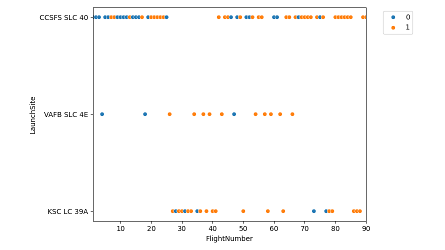
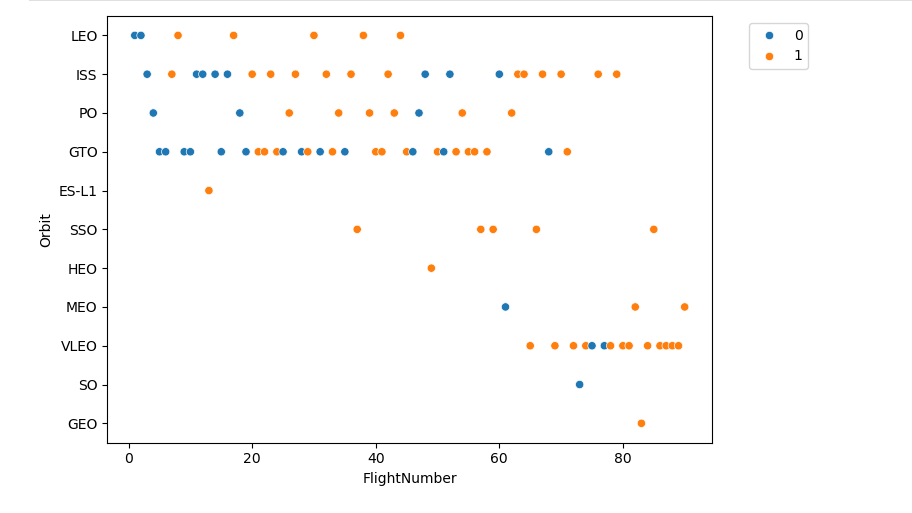
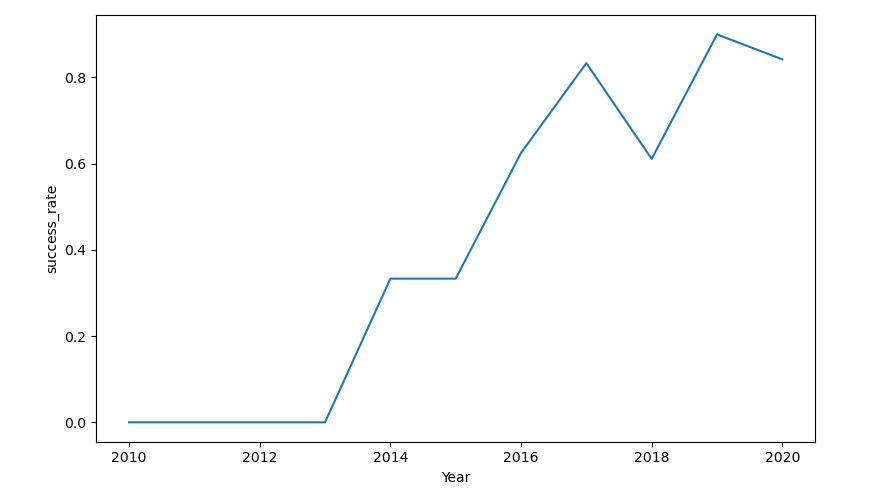
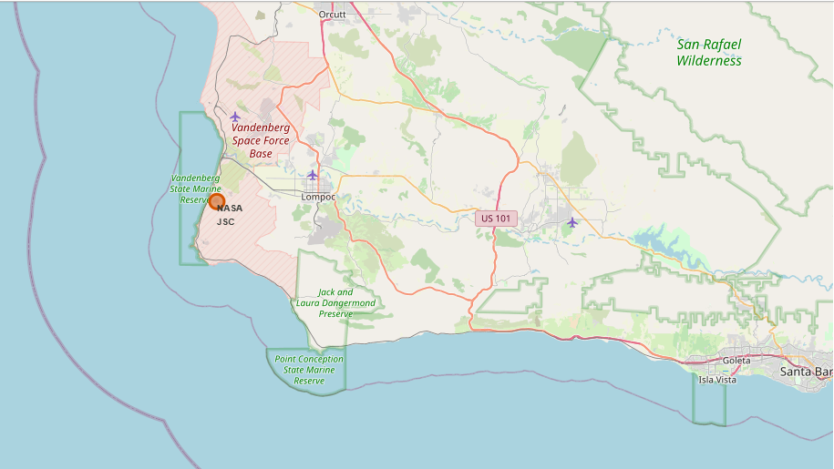

---

#  SpaceX Falcon 9 Landing Success Prediction

---

##  Project Overview
This project is an end-to-end data science capstone that analyzes historical SpaceX Falcon 9 launch data and builds machine learning models to predict the success of first-stage landings.

---

##  Objectives
- Collect launch data using the SpaceX REST API  
- Perform data wrangling and feature engineering  
- Conduct exploratory data analysis using SQL and visualization  
- Analyze launch site locations using geospatial techniques  
- Build and evaluate machine learning models for landing success prediction  

---
## Exploratory Data Analysis (EDA)

Key visual insights from the exploratory data analysis are shown below.

### Flight Number vs Launch Site

### Flight Number vs Orbit Type

### Launch Success Trend Over Time

### Payload Mass vs Launch Site

### Payload Mass vs Orbit Type

---

## Geospatial Analysis

Geospatial analysis was performed using Folium to study launch site locations, nearby infrastructure, and launch outcomes.

### Launch Outcome Distribution (Geospatial)

### Launch Outcome Clustering Near Launch Site

### Distance to Nearest Infrastructure

### Cape Canaveral Launch Site Map

### Vandenberg Launch Site Map

---

##  Repository Structure
01_data_collection_api.ipynb
02_data_wrangling_feature_engineering.ipynb
03_sql_exploratory_data_analysis.ipynb
04_exploratory_data_analysis_visualization.ipynb
05_spacex_launch_site_geospatial_analysis.ipynb
06_spacex_launch_success_prediction.ipynb

---

##  Datasets
- `Spacex.csv` – Raw SpaceX launch data  
- `data_falcon91` – Intermediate processed dataset  
- `updated_data_falcon92` – Final cleaned dataset used for modeling  
- `spacex_launch_geo.csv` – Geospatial launch site information  
- `Data_to_be_fed.csv` – Model-ready feature dataset  
- `my_data1.db` – SQLite database used for SQL-based analysis  

---

##  Technologies Used
- Python  
- Pandas, NumPy  
- Matplotlib, Seaborn  
- Folium  
- SQL (SQLite)  
- Scikit-learn  

---

##  Machine Learning Models
- Logistic Regression  
- Support Vector Machine (SVM)  
- Decision Tree Classifier  

---

##  Key Insights
- Launch site location significantly affects landing success  
- Certain orbit types show consistently higher success rates  
- Machine learning models achieve strong predictive performance  

---

##  Conclusion
This project demonstrates how historical SpaceX launch data combined with data science and machine learning techniques can be used to predict Falcon 9 first-stage landing outcomes.

---
